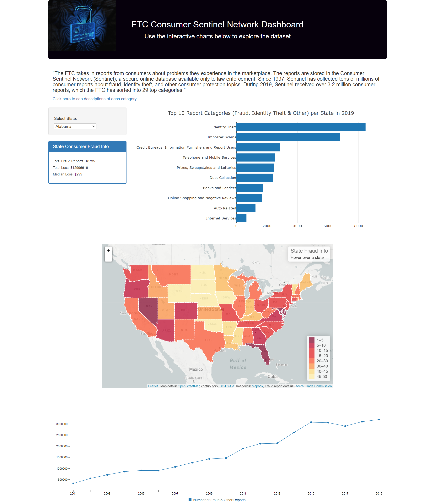

# fraud_identity_theft_reports

Our full-stacked web development team created an interactive website related to fraud, identity theft and other reports based on data researched from the Federal Trade Commission (FTC).  We utilized the following languages and libraries: Python Flask-powered RESTful API, HTML/CSS, JavaScript, SQLite, D3, Leaflet, Plotly and Billboard.js.

Please click the link below to see our website hosted on Amazon Web Services (AWS).

http://fraudreport-env.eba-gs8vz3nf.us-east-2.elasticbeanstalk.com/

After reviewing the data, the top 3 states that had the highest number of fraud reports per 100,000 population were: 1) Nevada, 2) Florida, and 3) Delaware.  

