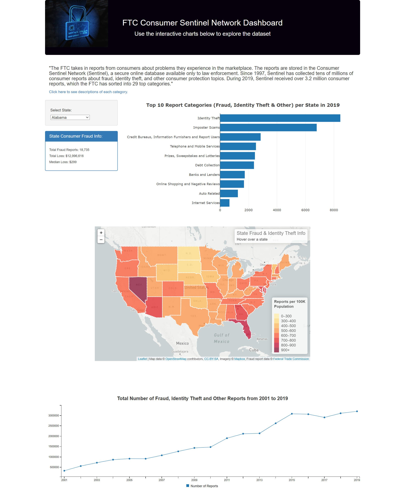

# fraud_identity_theft_reports

Our full-stacked web development team (Ian Housman, TJ Jaramillo, and Darlene Ko) created an interactive website related to fraud, identity theft and other reports based on data researched from the Federal Trade Commission (FTC).  We utilized the following languages and libraries: Python Flask-powered RESTful API, HTML/CSS, JavaScript, SQLite, D3, Leaflet, Plotly and Billboard.js.

Please click the link below to see our website hosted on Amazon Web Services (AWS).

http://ftcfraudreports-env.eba-j7pr6xbx.us-east-2.elasticbeanstalk.com/

After analyzing the data, the top 3 states that had the highest number of fraud, identity theft and/or other reports per 100,000 population were Nevada, Florida, and Delaware.  In terms of total dollar losses, California incurred over $187M in 2019, Texas incurred approximately $101M and Florida incurred approximately $90M.  Across all 50 states and the District of Columbia as well as Puerto Rico, the grand total of dollar losses amounts to $1.2B.  It appears that the overall trend of fraud reports have been increasing from 2001 to 2019, which has peaked to over 3.2 million in 2019.

